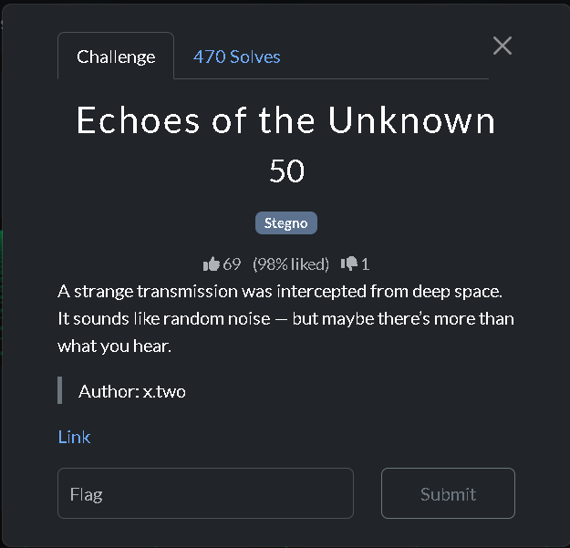
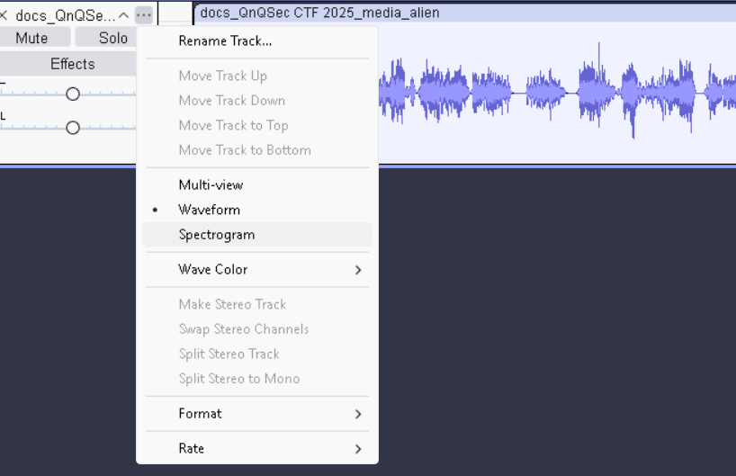
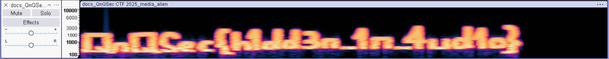

Genre: Warmup/Stegno
Level: Easy
#### Problem 2:Echoes of the unknown

This is the problem statement!!

And this is the hint : [alien.wav](alien.wav)

To be honest, i didn't earn a point in this problem as after the contest only i found the right software (Audacity) , which decrypts the audio and coverts it into spectrogram.I used the wrong software during the contest or the software which is unable to convert it into spectrogram.

We need to select _spectogram_ to be able to decrypt the secret message.

And after pressing _play_ ,i was able to decrypt the audio.

Actually, even after uncovering the flag i encountered several wrong answers as you can see it is not clearly written so i have to check each similar looking word and if it is incorrect and then try again with another letter and doing that i lost my accuracy and many more failed attempts. Eg.Writing 0 instead of o and likewise. So,the lesson i learned is to try all possible guesses in google docs and recheck with the given flag whichever is matching the most, submit that flag and earn the 100% accuracy. Just don't be reckless like me :( .

The flag is _QnQSec{h1dd3n_1n_4ud1o}_

