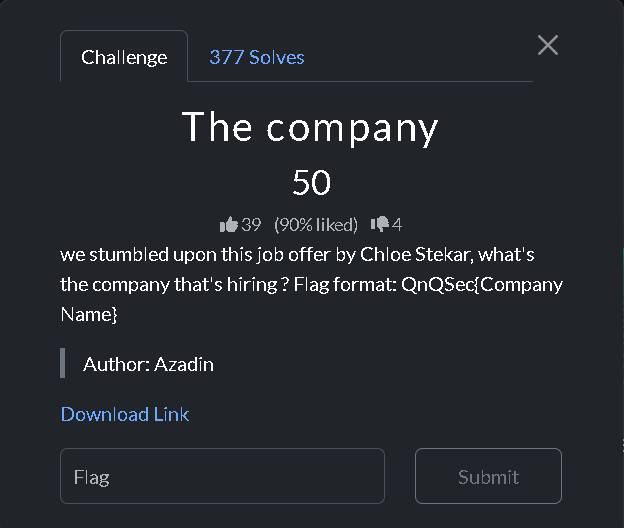
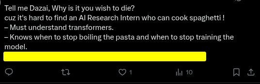
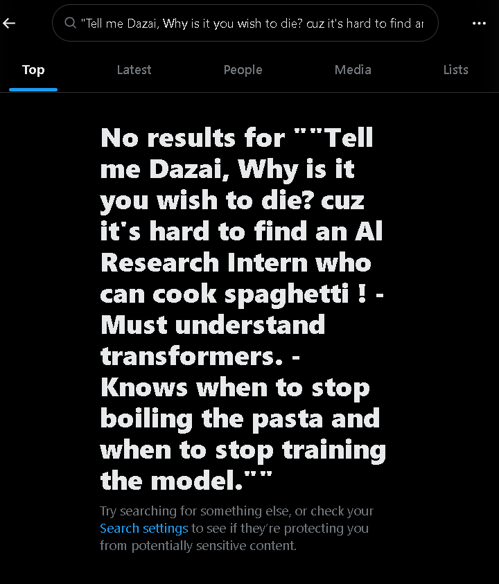
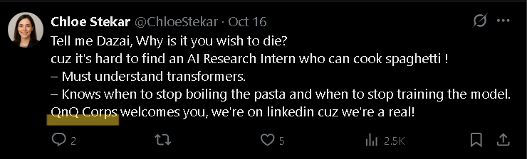

Genre:OSINT  
#### Problem 1:The company

This is the problem statement
  
  

This is the hint
  
 #### My Approach
 **_Firstly_**, i went to google(more specifically,google lens) to reverse search the image, but i couldn't find these, the search results only give the similar looking posts on X which was not enough to uncover the flag.
 
 **_Secondly_**, i went on to check X, i used the advanced search settings in which we can specifically search for the exact phrases, so i copy pasted the words given as hint and pasted in the "This exact phrase" box.Even, after doing this i couldn't uncover the solution ,it is quite hard in X to search as it didn't give any results sometimes. I don't know if it's a glitch or something.

**_Thirdly_**,i rechecked the problem statement in which it was given that a person named Chloe Stekar is providing some job offer, i didn't rethink twice and search for that account on X as i thought something was fishy and afterwards i began skimming through this specific account to find some hints but instead i found the flag to the problem.

The flag is **_QnQSec{QnQ Corps}_**
  
